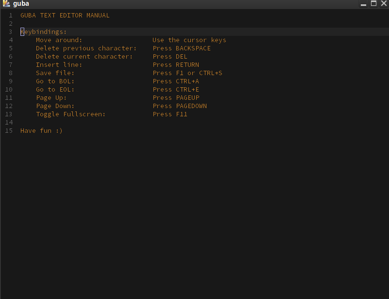

# guba



# Quick Start 

## Usage

```console
$ zig build run -- WELCOME.txt
```

### Notes
 * Probably there are problems with Windows because of '\r\n'
 * If you want to make stress test (with big files) you need to run it with 
 ```console
 $ zig build run -Drelease-fast -- <filepath>
 ```
 * **DON'T TRY TO EDIT AN IMPORTANT FILE (it is not fully bug free)**

# Font

Source Code Pro: https://github.com/adobe-fonts/source-code-pro
